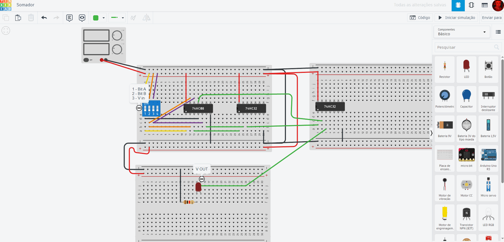

# Simulador de Somador de 1 Bit (Vout) — Tinkercad 🛠️

Este projeto é uma simulação inicial de um **somador de 1 bit**, focada apenas na implementação do **Carry-Out (Vout)**.  
Foi desenvolvido como parte dos estudos para a construção de um **somador de 3 bits** completo no CircuitVerse.

---

## 📋 Descrição

- Simulação realizada no **Tinkercad** para validar apenas a lógica do **Carry-Out (Vout)**.
- **Vin (Carry-In)** fixado em **0** durante os testes.
- O circuito atual não calcula a soma (**S**), apenas o **carry**.

---

## 🔥 Próximos passos

- Completar o somador de 1 bit com a lógica da **Soma (S)**.
- Expandir o projeto para um **somador de 3 bits** completo.

---

## 📂 Materiais disponíveis

- 🖼️ GIF demonstrativo da simulação

- 📄 Arquivo exportado do Tinkercad (.brd )
- 🔗 [Acesse a simulação no Tinkercad aqui](https://www.tinkercad.com/things/a8xSBzxUf3Z/editel?returnTo=%2Fprojects&sharecode=ovCnDKJl93iKsV01vfYwhYtNPlSw7E8s3y6qJv_SfMg)

---

## ✏️ Observação

Esta simulação foi criada para estudar o comportamento da lógica combinacional de carry-out, utilizando o Tinkercad como ferramenta em nuvem.  
Essa abordagem incremental me ajuda a validar conceitos antes da integração final no projeto maior.

---

> Projeto desenvolvido por Gabriel Goulart. 🚀
